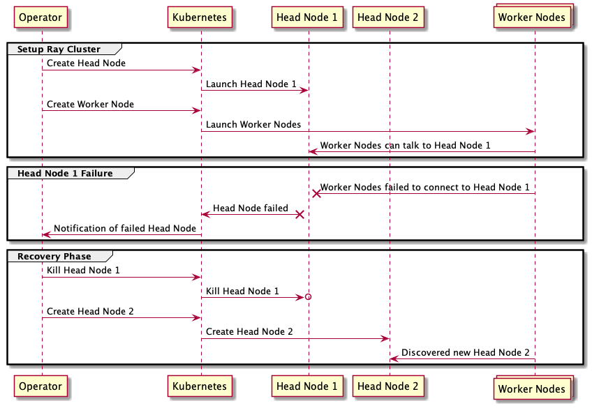

# KubeRay Support For Ray GCS HA

##### Author: Wilson Wang

## Introduction

Ray cluster fault tolerance is one of the most important goals for [Ray 2.0 release](https://github.com/ray-project/ray/issues/22833).
To support this, Ray's global control store (GCS) need to add failover support. In current design, discovering failed head node and
restarting a new one is not handled by Ray. Instead, the infra layer needs to handle this. In our case, KubeRay is responsible for
starting a new head node whenever a failed head node is detected.

## Proposed Solution

To enable the Ray GCS HA support, KubeRay needs to support monitoring the head node health state. In case failure is detected, KubeRay needs to start
a new head node to replace the existing failed head node. Ideally, as soon as the head node is working and the worker nodes find this new head node.
The cluster will automatically recover.

## Assumptions

* KubeRay assumes Ray cluster can handle the cluster recovery as long as KubeRay can bring up a new
head node whenever a head node failure is detected.
* KubeRay assumes an external HA-enabled KV store backend(such as Redis) is required.
* KubeRay assumes the new head node needs to have the same DNS name as the old failed one.

## Constraints / Limitations

* KubeRay will not handle internal errors that cannot observed from outside of Ray cluster.
* KubeRay's support for GCS HA only works for Ray cluster that has one head node and with a HA-enabled KV backend.

## System Design and Architecture

### Head-Node Health Monitoring

Current KubeRay does not kill unhealthy head nodes. To support Ray GCS HA, KubeRay operator
reconcile logic needs to be modified so that unhealthy head nodes can be detected and removed before
adding a new replacing head node.

### External Redis Cluster

1. User-Provided External Redis Cluster

When RAY_REDIS_ADDRESS is specified in the environment variables, the Ray head node will use the
address specified in this variable as the address of the external Redis cluster address. The GCS
server will try to use the Redis server with this address as the KV backend.

This should be a straightforward setting. The user can simply add environment variables to head node
template so that when the head node is created, the GCS server will pick the external Redis address.

2. KubeRay-Managed External Redis Cluster

In this case, KubeRay is responsible for managing the external Redis cluster. It creates a new Redis  
cluster and assign it to the newly created Ray cluster. For now, we don't support this functionality
since it requires modifications to KubeRay RayCluster object definition.

### System diagram or flowchart 

### Terminology and components

N/A

### Hard and soft dependencies

* KubeRay requires a minimum version of Ray to work.
* KubeRay requires an external HA-enabled KV storage for Ray GCS HA to work.

### Algorithm or Pseudo code for main components

N/A

### Performance requirements

N/A

### Security

N/A

## API

N/A

## Rollout Plan

- Deploy KubeRay cluster with external Redis cluster
- Verify default behavior by killing Ray Head Node in current KubeRay code.
- Modify Head Node reconcile logic to shutdown unhealthy Head Node and create replacement
- Verify the modified behavior for GCS HA recovery support

## Test Plan

### Basic test
Test basic GCS HA functionality. Bring up a Ray cluster, kill the head node and bring up another
totally new Ray cluster.

### Test different behaviors while GCS is down.
// TODO
Actor:
Task: already running task vs new task
Placement Group:
Dashboard: 
Ray State API:

### 

## Appendix 

- References, links to additional documentation (E.g. Product specification or Business requirements with acceptance criteria )

## Review Sign-Off

### Internal Review

- **Team lead/manager**: *Sign-off by * 
- **Sponsor**: *Sign-off by * 

**Target sign-off:** no late than *2 weeks from date of submission - format MM/DD/YYYY (WWW).* 

**
**

**[Sign-off Completed on] **
